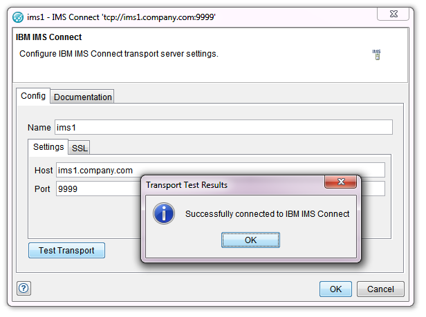
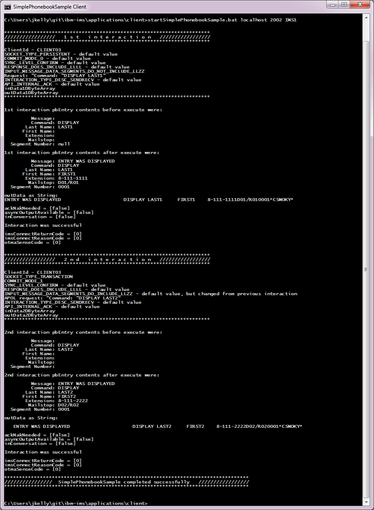

# ibm-ims

Example of how Rational Integration Tester can be used to trace and test IMS resources.
 
	
- Several Java IMS Connect sample applications. These are functionally identical to 
the samples shipped as part of  **IMS Enterprise Suite Connect APIs for Java** other than the host &amp; port can be specified on the command line.  

 
- A RIT project which contains
	- A test suite to run the IVTNO transaction
	- A stub which simulates the IVTNO transaction
	- COBOL copybooks defining the input and output structure on the IVTNO messages.
	- Monitor definitions for the relevant operations.
  
## Post download instructions

After download of the project, the folder structure for the ibm-ims is:

    ibm-ims
        rit-projects
            rit-project-ibm-ims.zip
        applications
            client
               IMSESConnectAPIJava
               startSimplePhonebookSample.bat
                             
- Unzip rit-projects/rit-project-ibm-ims.zip. This contains a RIT project ibm-ims.ghp
- Download the required **IMS Enterprise Suite Connect APIs for Java** libraries
 from [www.ibm.com/software/data/ims/connect/](www.ibm.com/software/data/ims/connect/) and 
 unzip into the ibm-ims/applications/client/IMSESConnectAPIJava folder.                

## Configuring the RIT project to match your IMS environment

The RIT project's *Production* environment has been configured to an IMS system on ims1.company.com:9999. You need to modify the project settings
to refer to your own IMS system. 

- Start RIT.
- Select Open, then navigate to the ibm-ims/ibm-ims.ghp file. 
- Go to "Architecture School" (F9).
- Select "Physical View" tab
- Open **ims1**
- Change hostname and port to match your IMS server settings
- Verify connection by using the "Test Transport" button, then select **OK**
- Select **OK** to save changes.

 
## Running the sample Simple phonebook application
- Open a command prompt.
- Change directory to ibm-ims/applications/client.
- Run startSimplePhonebookSample.bat *hostname* *port* *datastorename*.

A trace log SimplePhonebookSampleTrace.log is created by IMS Connect

## Intercepting the sample phonebook application flows
- Modify the HTTP/TCP proxy service configuration file httptcp/registration.xml by adding the following line:

  &lt;forward bind="localhost:2002" destination="*hostname*:*port*" type="ims" /&gt;

- Stop, re-start the HTTP/TCP proxy service. Now, IMS traffic directed to localhost:2002 will be directed to *hostname*:*port*
- Re-run application, redirecting traffic through the intercept
 
  startSimplePhonebookSample.bat localhost 2002 *datastorename*.

  

## Recording the sample phonebook application
- Start RIT.
- Select Open, then navigate to the ibm-ims/ibm-ims.ghp file. 
- Go to "Recording Studio" (F9).
- In the Events Monitors window import monitors from file *monitors.rsh*. 
- Select *Record*.
- Open a command prompt.
- Change directory to ibm-ims/applications/client.
- Re-run application, redirecting traffic through the intercept
 
  startSimplePhonebookSample.bat localhost 2002 *datastorename*.
  
- Using the application will results in operations being shown in the Events View window of RIT.  

